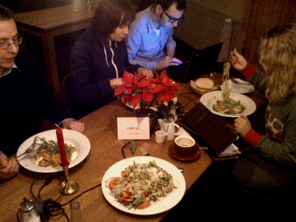

Vor einigen Monaten äußerte Gerald Schleiwies (Salzgitter) an einem
anderen Ort die Vermutung, "dass der (betriebswirtschaftliche) Weg der
öffentlichen Bibliotheken mit Rankingvergleichen nach über zwei
Jahrzehnten bald zu Ende gehen sollte".[^1] Versteht man diesen "Weg"
auch als Einsatz von relativ einfachen empirischen Tools, scheint die
Ausgabe \#27 der LIBREAS dies zu bestätigen. Die Methoden, welche
besprochen werden, halten sich nicht damit auf, quantitative Daten zu
erheben und zu vergleichen; vielmehr thematisieren und plädieren sie für
ein erweitertes Methodenset, dass für das Verständnis davon, was in
Bibliotheken eigentlich genau passiert, eingesetzt werden sollte.
Insbesondere qualitative Methoden werden dabei als sinnvoll beschrieben.
Einher geht dies auch mit einer Verschiebung dessen, was mit diesen
Methoden verstanden werden soll. Heben die von Schleiwies gemeinten
Methodensets –- allen voran der BIX –- darauf ab, Outcomes zu definieren,
die eine Aussage über die Qualität der Arbeit von Bibliotheken erlauben
sollen und diese miteinander zu vergleichen sowie in Beziehung zu
setzen, scheinen sich die Beiträge dieser Ausgabe vor allem dafür zu
interessieren, was Nutzerinnen und Nutzer konkret in einer – ebenso
konkreten – Bibliothek tun.

Ist das eine Kehrtwende? Hat das Bedeutung für die Bibliotheken? Das
bleibt offen. Unbesehen der ständig erhobenen Forderungen, in der
Ausbildung für Bibliothekarinnen und Bibliothekare mehr Methodenwissen
unterzubringen (zum Beispiel im Artikel von Felix Hüppi) und Versuchen
von Hochschulen, die zu bewerkstelligen (siehe den Beitrag von Karsten
Schuldt und Rudolf Mumenthaler), scheint das konkrete Interesse, darüber
zu schreiben, wie diese Methoden in der Praxis wirklich genutzt werden,
relativ gering zu sein. Hüppi berichtet in dieser Ausgabe davon, wie er
Methoden im konkreten Raum Bibliothek während seiner Abschlussarbeit
nutzte. Auch Christoph Szepanski fasst Ergebnisse seiner Masterarbeit
zusammen, in welcher er sich mit der Anwendung von Metatheorien am
Beispiel der der Activity Theory auf die Informationswissenschaft
beschäftigt. Gerne hätten mehr Artikel zum Schwerpunktthema zusammen
kommen können. Eventuell ist jedoch für die nächsten Jahre auch schon
alles Wichtige und Sagbare zu diesem Thema in den drei Handbüchern zur
Methodik veröffentlicht worden, die Corinna Haas in ihrem Beitrag auf
die Darstellung von Ethnologie hin befragt.

Weitere Beiträge beschäftigen sich mit dem Konzept einer
informationellen Stadt mit ubiquitären Diensten und stellt anhand der
Ergebnisse einer Befragung beispielhaft die Situation der
südkoreanischen Stadt New Songdo City dar, erläutert von der Gewinnerin
des SWIF 2014 Aylin Ilhan. Andreas Degkwitz spricht sich für eine
Entwicklung der Zentralbibliothek von einer Special Subject Collections
hin zu einem Discipline Driven Information Provisioning aus, ein auf dem
17th Fiesole Collection Development Retreat am 06.05.2015 in Berlin
gehaltenen Vortrag, den wir freundlicherweise veröffentlichen dürfen.

Rezensionen kommen diesmal von Übersee zu Information Services Today und
vom Über-den-Tellerrand, bei der wir über den Bibliotheksbezug in der
Pop-Rock-Musik erfahren. Eventuell wird dies zur künftigen Kolumne.

---

Im Sommer dieses Jahres wird *LIBREAS.Library Ideas* zehn Jahre alt, was
eine auch für uns als Redaktion erstaunliche Zeitspanne ist. Sind wir
wirklich schon so alt geworden? Haben wir schon unseren jugendlichen
Elan hinter uns gelassen oder hatten wir nie welchen? Haben wir unsere
Träume aufgegeben? Haben wir uns zumindest inhaltlich gefunden? (Haben
wir noch nicht, immer noch sind wir über die Zuschreibungen von aussen
erstaunt, die unserer Projekt mal als Studentenzeitschrift und mal als
zu anspruchsvoll, mal als theoretisches Organ und mal als Feuilleton,
mal als akzeptierten Publikationsort und mal als kritisches Organ im
Bibliothekswesen bezeichnen.)

Und dennoch: Zehn Jahre sind eine lange Zeit, in der nicht nur die
Zeitschrift, sondern auch wir uns verändert und uns in verschiedene
Richtung gehen lassen haben. Deshalb trauen wir uns, einmal zu unserer
Grundfrage und Grundhaltung zurückzukehren und in einem Symposium die
Frage diskutieren zu lassen, was die *Bibliothek als Idee* eigentlich
genau ist. Dieses Symposium gestalten wir aus dem Bauch heraus, so wie
wir uns ein interessantes Treffen, das wir besuchen wollten, vorstellen
(so wie wir eine Zeitschrift zu gestalten versuchen, die wir lesen
wollen würden) und das beinhaltet auch, unsere Leserinnen und Leser –-
und vor allem die Mitglieder des LIBREAS. Vereins –- für das
Spätsommer-Wochenende vom 12./13. September 2015 nach Berlin einzuladen,
zu Symposium, Diskussion, Feterei, gemeinsamen Frühstück wie es Berliner
mögen und Vereinssitzung, die jährlich stattfindet. Referentinnen und
Referenten, Ort und weitere Metadaten berichten wir über unsere
etablierten elektronischen Kanäle.

Eure / Ihre Redaktion LIBREAS. Library Ideas

(Berlin, Bielefeld, Chur, München, Potsdam)

[^1]: https://stadtbibliotheksalzgitter.wordpress.com/2015/03/22/hurra-hurra-die-konkurrenz-ist-da-ein-pladoyer/
