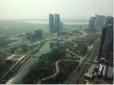
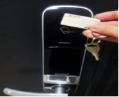
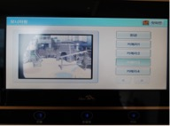
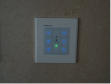
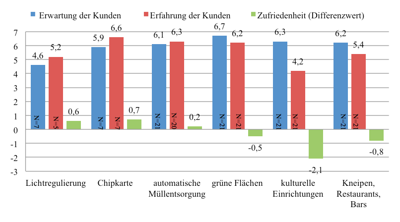
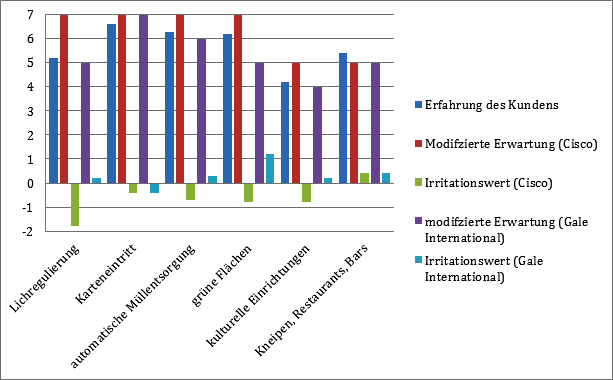

### Smarte und ubiquitäre Städte als Forschungsthema der Informationswissenschaft

Mit dem Aufkommen der Computer, des Internets und des Smartphones sind
Personen in der Lage, Informationsbedürfnisse zu stillen. Was passiert
aber, wenn das Informationsbedürfnis über die "klassische"
Retrievalkomponente hinausgeht? Bewohner einer ubiquitären Stadt könnten
erwarten, dass der Kühlschrank immer eine gewisse Anzahl von bestimmten
Lebensmitteln enthält. Falls das nicht der Fall ist, soll der
Kühlschrank selbstständig die fehlenden Lebensmittel bestellen. Auch das
Bedürfnis, eine Auskunft über den eigenen Stromverbrauch in den letzten
Wochen zu erhalten, zählt zu den nicht klassischen
Informationsbedürfnissen. Ist jemand gesundheitlich angeschlagen, so
wird dem behandelnden Arzt sofort die Information übermittelt, dass er
ohnmächtig geworden ist oder dass sein Blutdruck einen kritischen Wert
überschritten hat. Letztlich können wir als Bewohner einer ubiquitären
Stadt wohl auch erwarten, dass wir mit einer Chipkarte alles regeln
können: die Schließung der Wohnung, den Eintritt in die lokale
Bibliothek, den Zugang zur U-Bahn, die Begleichung der Rechnung im
Restaurant. Oder?

An verschiedenen Orten der Welt entstehen sogenannte "Smart Cities"
beziehungsweise "ubiquitäre Städte". Smart Cities sowie ubiquitäre
Städte verfügen über eine stark ausgeprägte technologische
Infrastruktur. Mittels Informations- und Kommunikationssystemen werden
den Bewohnern bestimmte Techniken zur Verfügung gestellt, die den Alltag
sowie das Berufsleben erleichtern sollen. Masdar City in den Vereinigten
Arabischen Emiraten sowie New Songdo City in Südkorea sind solche
neuartigen Städte. In diesem Bericht soll auf Ergebnisse einer
Forschungsarbeit hinsichtlich der südkoreanischen Stadt New Songdo City
eingegangen werden. Das Ziel hierbei ist herauszufinden, welche
ubiquitären Systeme bereits in New Songdo City implementiert wurden und
wie zufrieden die Bewohner mit diesen Systemen sind.

Was bedeutet "smart" und "ubiquitär" in Bezug auf Städte? Fietkiewicz
und Stock (2015) definieren eine "Smart City" mit Hilfe von zwei
Konzepten. Das erste Konzept ist eine engere Definition des Begriffes
"Smart City". Angelehnt an Chourabi, Nam, Walker, Gil-Garcia, Mellouli,
Nahon, Pardo, & Scholl (2012, S. 2289) wird eine "Smart City" als eine
"nachhaltige und lebenswerte Stadt" charakterisiert. In einer Smart City
werden Ziele verfolgt, die dazu beitragen, dass eine Stadt
umweltfreundlich und sicher ist (Hall, Bowerman, Braverman, Taylor,
Todosow, & von Wimmersperg, 2000). Das zweite Konzept deckt einen
größeren Bereich von diversen Aspekten ab und entspricht eher der
breiteren Auffassung einer "informationellen Stadt". Angelehnt an
Giffinger et al. (2007) gehören zu den wichtigen Aspekten unter anderem
die "smart economy, smart people, smart governance, smart mobility,
smart environment, and smart living" (Fietkiewicz & Stock, 2015, S.
2345). Darüber hinaus enthält die breitere Definition einer "Smart City"
natürlich auch die engere Auffassung einer Smart City, nämlich die
ökologischen Aspekte.

Die Forschungsarbeit ist an informationswissenschaftliche Methoden und
Konzepten angelehnt (Stock & Stock, 2013). Hierzu zählt auch die Theorie
von Manuel Castells hinsichtlich der Netzwerkgesellschaft (Castells,
2010) sowie der informationellen Städte (Castells, 1989). Unsere
Forschungsarbeit ist ein wichtiger Bestandteil eines größeren
Forschungsprojektes über Städte, die als prototypisch für die
Wissensgesellschaft gelten. Auch hier liegen theoretische Konzepte zu
Grunde, wie solche prototypischen Städte des 21. Jahrhundert aussehen
(Stock, 2011; Khveshchanka & Mainka, 2011; Mainka, Khveshchanka, &
Stock, 2011; Linde & Stock, 2011). Darüber hinaus existieren aber auch
empirische Ergebnisse über essentielle Bestandteile informationeller
Städte. Hierzu gehören zum Beispiel digitale und physische Bibliotheken
(Mainka & Khveshchanka, 2012; Mainka, Hartmann, Orszullok, Peters,
Stallmann, & Stock, 2013) aber auch das e-Government (Mainka,
Fietkiewicz, Kosior, Pyka, & Stock, 2013; Mainka, Hartmann, Stock, &
Peters, 2014). Prototypische Städte des 21. Jahrhunderts gibt es auf der
ganzen Welt verteilt. Solche informationellen Städte, wie Oulu in
Finnland (Schumann, Rölike, & Stock 2013), Städte der Golf Region,
japanische Städte (Fietkiewicz & Pyka, 2014; Fietkiewicz & Stock, 2014),
London (Murugadas, Vieten, Nikolic, & Mainka, 2015) sowie Singapur
(Khveshchanka, Mainka, & Peters, 2011) wurden bereits untersucht.

### Die ubiquitäre Stadt New Songdo City

Etwa 65 Kilometer entfernt von der südkoreanischen Hauptstadt Seoul
befindet sich heute nicht mehr das Wattenmeer, sondern die Stadt New
Songdo City (kurz Songdo) (Abb. 1). Sie ist ein Teil der Millionenstadt
Incheon. New Songdo City erstreckt sich über circa. 600 Hektar (Lee &
Oh, 2008). Sie ist die erste geplante südkoreanische ubiquitäre Stadt.

Familien, aber auch viele Geschäftsleute sollen hier eine neue
Möglichkeit finden, um zu arbeiten und zu wohnen. Segel (2005, S. 1)
beschreibt die Stadt als "den prinzipiellen Business Mittelpunkt in
Nordasien". Dies wird durch Faktoren wie zum Beispiel Lage und
fortgeschrittener Infrastruktur begünstigt (Segel, 2005). Mit Hilfe von
moderner Architektur sowie der Integration von Informations- und
Kommunikationstechnologien soll New Songdo City eine Stadt werden, die
nicht nur aus ökonomischer Sicht, sondern auch aus Sicht des technischen
Fortschrittes als ein Vorzeigebeispiel dient. Die Stadt ist im
Wesentlichen durch eine an den Westen angelehnte Architektur geprägt
(Kim, 2010). So enthält sie einen eigenen Central Park, angelehnt an den
New Yorker Central Park, sowie eine Einkaufsgasse Canal Walk (Abb. 2),
die den Kanälen in Venedig ähnelt (O’Connell, 2005). Für die Architektur
sind die amerikanische Firma Gale International sowie die koreanische
Baufirma POSCO E&C verantwortlich (Kim, 2010). Das amerikanische
Unternehmen Cisco ist als Entwickler der digitalen ubiquitären Dienste
in New Songdo City (Halpern, LeCavalier, Calviloo, & Pietsch, 2013)
verantwortlich.

Eine solche ubiquitäre Stadt ist, angelehnt an Jang und Suh (2010, S.
263), eine "im 21. Jahrhundert futuristische Stadt". Hinter dem
lateinischen Begriff *ubiquitär* versteckt sich der Begriff
*allgegenwärtig*. Allgegenwärtig sind in ubiquitären Städten die
Informations-und Kommunikationstechnologie (IKT). Mit Hilfe von IKT ist
das "[...] Management von Verkehr, Abfall, Elektrizität, Abwasser und
Wasserqualität [möglich] [...]" (Lee, Han, Leem, & Yigitcanlar, 2008, S.
1). Das Ziel im Bereich ubiquitous computing spiegelt sich in der
Einbindung von Rechnern in unseren Lebensraum wider (Weiser, 1991, S.
4). Aber wie kann man sich das vorstellen? Anders als bei Computer, die
die Nutzer in ihrer Umwelt aktiv sehen und benutzen, sollen beim
ubiquitous computing Rechner in unsere physikalische Umgebung so
eingebaut werden, dass sie für den Nutzer unsichtbar bleiben (Weiser,
1993).

Anders formuliert bedeutet dies, dass ubiquitous computing als "[...]
die Allgegenwärtigkeit von Informationstechnik und Computerleistung
verstanden [wird], die in prinzipiell alle Alltagsgegenstände
eindringen" (Friedewald, Raabe, Georgieff, Koch, & Neuhäusler, 2010, S.
9). Hierbei werden Mikroprozessoren bis hin zu Sensoren in
Objekte/Geräte eingebaut, die dann bestimmte Informationen erfassen,
verarbeiten und weitergeben (Friedewald et al., 2010). Häufig liest man
in diesem Zusammenhang über den Begriff "Internet der Dinge". Angelehnt
an Friedewald et al. (2010) ist dies jedoch nur ein reiner akademischer
Unterschied zum ubiquitous computing, da auch hier das Ziel dadurch
charakterisiert wird, dass zum Beispiel anhand eingebauter
Mikroprozessoren und Sensoren viele Tätigkeiten unterstützt und
erleichtert werden sollen. Mit Hilfe der RFID-Tags können Gegenstände
"identifiziert, verfolgt und lokalisiert" werden (Weber, 2009, S. 522).
Hierbei handelt es sich um einen elektronischen Produkt-Code (Weber,
2009). Solch ein RFID-Tag könnte in ein Buch eingebaut werden, so dass
Bibliothekare jederzeit exakte Informationen erhalten, wo sich das Buch
befindet oder ob vielleicht auch ein Buch gestohlen wurde. Ein anderes
prototypisches Beispiel im Bereich "Internet der Dinge", das häufig
genannt wird, ist der intelligente Kühlschrank. Hinter dieser Idee
versteckt sich ein Kühlschrank, der automatisch fehlende Lebensmittel
nachbestellt. Damit dies jedoch funktioniert, müssen die entsprechenden
Lebensmittel mit einem RFID-Tag versehen sein. Erst so kann das Gerät
die genaue Menge an Lebensmitteln identifizieren.

Die Verfügbarkeit sowie der Einsatz von Breitband ist ein wichtiger
Aspekt in einer ubiquitären Stadt. In ubiquitären Städten ist es
wichtig, dass Breitband nicht nur der Allgemeinheit zu Verfügung steht,
sondern dass auch die Kosten tragbar sind, so dass die Einbindung und
Nutzung in öffentlichen Bereichen, wie zum Beispiel im Bereich der
Gesundheit und der Erziehung bzw. Schule möglich sind (Fietkiewicz &
Stock, 2015; El-Darwiche & Singh, 2010). Zusammenfassend lässt sich
sagen, dass Entwickler mithilfe von Sensoren, Prozessoren, RFID-Tags und
vielen weiteren Aspekten der IKT eine Kommunikation zwischen
Gegenständen, aber auch den Dialog zwischen Mensch und Gegenstand zu
unterstützen beziehungsweise zu vereinfachen versuchen.

### Methoden

Für die Akzeptanz- und Informationsbedarfserfassung sowie für die
Untersuchung, ob es sich bei New Songdo City um eine ubiquitäre bzw.
smarte sowie um eine urbane Stadt handelt, wurden verschiedene Methoden
angewendet (Ilhan, Möhlmann, & Stock, 2015). Um einen Eindruck von der
Stadt zu erhalten, wurde ein Aufenthalt von einer Woche eingeplant. In
dieser Woche wurden vor Ort mit insgesamt 23 Bewohnern (inklusive
Mitarbeiter des Unternehmens Gale International und Cisco) Interviews
durchgeführt, ausgehend von einem Fragebogen, der der SERVQUAL-Methode
ähnelt (Parasuraman, Zeithaml, & Berry, 1988). Hier kommt es darauf an,
dass man zum einen die Erwartung sowie zum anderen die Erfahrung des
Befragten zu einem bestimmten Thema erfahren will. Die
Antwortmöglichkeiten werden hierbei mit Hilfe einer Skala dargestellt,
die eine Auswahlmöglichkeit zwischen den Werten 1 (stimmt gar nicht) und
7 (stimme voll zu) anbietet. Der SERVQUAL-ähnliche Fragebogen ermöglicht
es, einen Eindruck davon zu erhalten, wie zufrieden Personen mit den
angebotenen Diensten sind und ob bestimmte Dienstleistungen in New
Songdo City überhaupt vorhanden oder integriert sind (Abb. 3). Wertet
man die Ergebnisse aus, so ergeben sich drei Werte: Erfahrungswert,
Erwartungswert und der Differenzwert. Letzteren erhält man durch die
Subtraktion des Erwartungswertes von dem entsprechenden Erfahrungswert.
Insgesamt haben wir 21 Bewohner befragt, wovon 14 Interviewpartner
Studierende sind. Bei bestimmten Fragen wurden die Studierenden
ausgeschlossen, da sie nicht wie die restlichen 7 Bewohner in
Appartements, sondern in Studentenwohnheimen wohnen. In diesen
Studentenwohnheimen sind bestimmte Ausstattungen nicht vorhanden.

Die Interviews mit Gale International und Cisco weichen von den
Interviews mit den Bewohnern ab. Zwar waren die beiden Interviews
ebenfalls angelehnt an einen Fragebogen, hier jedoch basierend auf die
Customer Value Research-Methode (McKnight, 2006). Diese Art von
Fragebogen ähnelt dem SERVQUAL-Verfahren, wobei nun nicht mehr die
Erwartung auf der linken Seite gefordert wird, sondern lediglich die
modifizierte Erwartung des Experten. Dabei handelt es sich um eine
Einschätzung der Personen. Der Experte versetzt sich in die Lage seines
Kunden, in dem er die Erfahrung seines Kunden einschätzt. Die rechte
Seite des Fragebogens spiegelt dabei die Erfahrung des Nutzers, die aus
dem SERVQUAL-ähnlichen Fragebogen entnommen wird. Diese Methode
ermöglicht es, einen "Irritationswert" zu erhalten, in dem der
modifizierte Erwartungswert des Entwicklers von dem durchschnittlichen
Erfahrungswert des Nutzers subtrahiert wird. So kann dann ausgewertet
werden, inwiefern die Kunden mit den Produkten der Entwickler wirklich
zufrieden sind und ob die Experten die Qualität beziehungsweise die
Zufriedenheit ihrer Kunden richtig wahrnehmen.

### Akzeptanz der ubiquitären Informationsdienste bei den Bewohnern Songdos

Im Ergebnis lässt sich festhalten, dass einige ubiquitäre Systeme
bereits in New Songdo Cityumgesetzt und integriert wurden. Hierzu gehört
zum Beispiel die automatische Müllentsorgung (Abb. 5). Zum einen haben
die Bewohner die Möglichkeit, den Müllbeutel über einen Schacht, der in
den Korridor eingebaut ist, zu entsorgen und zum anderen befinden sich
in einigen Appartements die Schächte draußen auf dem Hof. Über
unterirdische Röhren, die als Beförderungsmittel dienen, werden die
Müllbeutel automatisch durch ein pneumatisches Unterdrucksystem zu einem
Ort transportiert, wo der Müll automatisch verarbeitet wird.

In jedem Appartement ist ein sogenannter Master Panel integriert. Dieser
ähnelt einem Tablet und ist an mehreren Zimmern in den Wohnungen an den
Wänden angebracht (Abb. 6). Es bietet verschiedene Funktionen vom
Telefonieren bis hin zur Ansicht des Energieverbrauches an. Auch die
Lichtregulierung kann über diesen Master Panel ausgeführt werden.
Zusätzlich besitzen die Appartements eine weitere Schaltfläche für die
Lichtregulierung (Abb. 7).

In den Höfen befinden sich Kameras vor der eigenen Haustür und im
Haupteingang der Wohnung. So können die Bewohner genau sehen, wer gerade
unten im Hof spielt. Eine weitere Besonderheit: Vor der Eingangshalle
gibt es ebenfalls ein Display, auf dem die Nummer der Wohnung eingetippt
wird, um zu sehen, wer gerade "anklingelt". Es kann gegebenenfalls auch
eine Unterhaltung geführt werden. Um den Müll in den Schacht im Korridor
zu entsorgen sowie aber auch um die Tür der Wohnung zu öffnen, benötigen
die Bewohner von New Songdo City eine Chipkarte (Abb. 4).

Freies Internet war zum Zeitpunkt unseres Aufenthaltes nur in Maßen
verfügbar. Häufig war dies über Hotspots unter anderem in Restaurants
möglich. Im Showroom von Cisco in New Songdo City gibt es noch viele
weitere ubiquitäre Systeme, die allerdings erst prototypisch zur
Verfügung stehen. Hierzu gehört beispielsweise ein nachgestelltes Büro,
das personalisiert wurde. Sobald die Tür zum Büro den eigenen
Fingerabdruck identifiziert hat, fahren die Jalousien hoch, das Radio
und die Klimaanalage schalten sich ein, alles auf die entsprechende
Person, die im Büro arbeitet, abgestimmt. Des Weiteren wurde eine von
uns befragte Bewohnerin von Cisco als Testperson für ein Produkt
ausgewählt. Hierbei handelt es sich um einem Receiver, der eine
Skype-ähnliche Unterhaltung zwischen Bewohnern aus verschiedenen
Wohnungen ermöglicht.

 

Abbildung 8 zeigt, dass die Erfahrung der Bewohner in einigen Bereichen
ihre allgemeine Erwartung übertrifft. Daraus kann man schließen, dass
die Anwohner mit den hier eingesetzten Systemen (Lichtregulierung,
Chipkarte, automatische Müllentsorgung) zufrieden sind. Allerdings
verdeutlicht die Befragung auch, dass die Bewohner mit den kulturellen
Einrichtungen unzufrieden sind. Die Auswertung der SERVQUAL-Fragen hat
ebenfalls ergeben, dass ubiquitäre Systeme wie ein intelligenter
Kühlschrank sowie Smart Health in New Songdo City nicht realisiert sind.

Auch bei der Auswertung des Customer Value Research-Fragebogens gab es
unterschiedliche Ergebnisse. Abbildung 9 demonstriert einen kleinen
Einblick in die Ergebnisse. Anhand der vorhandenen Irritationswerte wird
deutlich, dass die Experten zum Teil die Zufriedenheit der Kunden nicht
richtig einschätzen. Cisco schätzt die Zufriedenheit des Kunden
hinsichtlich der Lichtregulierung besser ein als sie letztendlich ist.
Anhand dieser Werte können Entwickler nun Schwachstellen erkennen und
entsprechend reagieren.

Zusätzlich wollten wir auch herausfinden, inwiefern New Songdo City als
eine urbane Stadt definierbar ist. Die Befragten bekamen eine
zusätzliche Frage, in der sie beantworten sollten, ob sie denken, dass
New Songdo City eine urbane Stadt ist. Saskia Sassen, US-amerikanische
Soziologin, sieht die Aktivität von Menschen sowie das Vorhandensein von
verschiedenen Bevölkerungsschichten als essentielle Merkmale einer
urbanen Stadt. Darüber hinaus ist eine urbane Stadt ständig in
Veränderung und Weiterentwicklung (Sassen, 2012). Angelehnt an Van
Diepen und Musterd (2009) sowie Latham (1999), spiegelt sich in
Stadtcafés sowie Stadtrestaurants die Funktionen einer urbanen Stadt
wieder. Trotz Unstimmigkeiten charakterisieren die Befragten New Songdo
City letztendlich mit 46 % als eine urbane Stadt (Abb. 10). Sassen
(2012) sieht hingegen ubiquitäre Städte wie Songdo nicht als einen
urbanen Raum an, sondern viel mehr als eine Stadt, die "deurbanisiert"
wird. Angelehnt an Sassen (2012) ist die Stadt New Songdo City in ihren
Funktionen nicht flexibel und besitzt auch keinen Freiraum, sich
unabhängig von Konzernen und der Technik weiterzuentwickeln. "Die
intelligente Stadt versucht sich als perfektes, geschlossenes System"
(Sassen, 2012). Allerdings zeichnet sich für Sassen (2012) eine urbane
Stadt dadurch aus, dass sie "nie vollkommen, nie fertig gebaut [ist],
sie ist in ihrer Geschichte immer wieder neu geformt und umgewandelt
worden".

### Diskussion

Dieser Teileinblick in die Ergebnisse zeigt auf, dass eine ubiquitäre
und urbane Infrastruktur in New Songdo City ansatzweise vorhanden ist.
Viele der vorgeführten ubiquitären Systeme, die im Showroom von Cisco
vorhanden sind, sind in die Lebensräume der Bewohner noch nicht
integriert. Das Potential des integrierten ubiquitous computing ist
somit noch ausbaufähig. Insgesamt fehlten der Stadt zum Zeitpunkt der
Forschung die Bewohner. Auf die Frage, "Lebst du in einer urbanen Stadt"
antwortet zum Beispiel ein Interviewpartner mit der Antwort: "Nein; die
Stadt ist zu 40-50% bewohnt".

New Songdo City befindet sich noch in der Entwicklung. Ob die Stadt sich
tatsächlich als ubiquitäre Stadt und gleichzeitig urban durchsetzen
wird, wird die Zeit zeigen. Dies wird letztendlich unter anderem davon
abhängen, ob das Potential ausgeschöpft wird und weitere ubiquitäre
Dienste, wie eine Handyfernbedienung, Smart Health, benutzereingestellte
Bürogebäude umgesetzt und den Bewohnern näher gebracht werden.

Weitere Forschungen sollten auch berücksichtigen, warum die Bewohner in
einer smarten bzw. ubiquitären Stadt leben wollen, welche Motivationen
vorliegen, überhaupt dorthin zu ziehen und ob bei ihnen eine spezielle
Bedürfnislage vorliegt, die besonders in ubiquitären und smarten Städten
befriedigt werden kann.

### Referenzen

Castells, M. (1989). *The Informational City. Information Technology,
Economic Restructuring, and the Urban-Regional Process.* Oxford, UK :
Blackwell.

Castells, M. (2010). *The Rise of the Network Society, 2^nd^ ed.*
Singapore: Wiley-Blackwell.

Chourabi, H., Nam, T., Walker, S., Gil-Garcia, J. R., Mellouli, S.,
Nahon, K., Pardo, T. A., & Scholl, H. J. (2012). *Understanding smart
cities: An integrative framework.* In *Proceedings of the 45^th^ Hawaii
International Conference on System Sciences* (pp. 2289-2297).
Washington, DC: IEEE Computer Society.

El-Darwiche, B., & Singh, M. (2010). *Enabling Sustainable Digital
Highways*. Booz & Company.

Fietkiewicz, K. J., & Pyka, S. (2014). Development of informational
cities in Japan: A regional comparison. *International Journal of
Knowledge Society Research, 5*(1), 69-82.

Fietkiewicz, K. J., & Stock, W. G. (2014). Cityness and informativeness
of the emerging informational cities in Japan. *Creative and Knowledge
Society, 4*(1), 43-56.

Fietkiewicz, K. J., & Stock, W. G. (2015). How "smart" are Japanese
cities? An empirical investigation of infrastructures and governmental
programs in Tokyo, Yokohama, Osaka and Kyoto. In *Proceedings of the
48^th^ Hawaii International Conference on System Sciences,* Jan 5-8,
2015, Kauai, Hawaii (pp. 2345-2354). Washington, DC: IEEE Computer
Science.

Friedewald, M., Raabe, O., Georgieff, P., Koch, D. J., & Neuhäusler, P.
(2010). *Ubiquitäres Computing: Das "Internet der Dinge" – Grundlagen,
Anwendungen, Folgen.* Berlin, Germany: edition sigma.

Giffinger, R., Fertner, H., Kramar, H., Kalasek, R., Pichler-Milanovic,
N., & Meijers, E. (2007). *Smart Cities – Ranking of European
Medium-Sized Cities*. Vienna, Austria: Centre of Regional Science.

Halpern, O., LeCavalier, J., Calviloo, N., & Pietsch, W. (2013).
Test-bed urbanism. *Public Culture, 25*(2), 273-306.

Hall, R. E., Bowerman, B., Braverman, J., Taylor, J., Todosow, H., & von
Wimmersperg, U. (2000). The vision of a smart city. In *2^nd^
International Life Extension Technology Workshop*. Paris, France.

Ilhan, A., Möhlmann, R, & Stock, W. G. (2015). Customer value research
and ServQual surveys as methods for information need analysis. The
ubiquitous city Songdo as a case study. In *Proceedings of the 14^th^
International Symposium of Information Science* (pp. 457-468).
Glückstadt: Hülsbusch.

Jang, M., & Suh, S.-T. (2010). U-City: New trends of urban planning in
Korea based on pervasive and ubiquitous geotechnology and
geoinformation. In D. Taniar, O. Gervasi, B. Murgante, E. Pardede, & B.
O. Apduhan (Eds.), *Proceedings Part 1 –Computational Science and Its
Applications – ICCSA 2010* (pp. 262-270). Berlin: Springer.

Khveshchanka, S., & Mainka, A. (2011). Informational cities as urban
centers of the knowledge era. In S. Marini (Ed.), *My Ideal city.
Scenarios for the European City of the 3^rd^ Millennium* (pp. 117-122).
Venezia, Italy: Università Iuav di Venezia.

Khveshchanka, S., Mainka, A., & Peters, I. (2011). Singapur. Prototyp
einer informationellen Stadt. *Information – Wissenschaft und Praxis,
62*(2-3), 111-121.

Kim, C. (2010). Place promotion and symbolic characterization of New
Songdo City, South Korea. *Cities, 27*(1), 13-19.

Latham, A. (1999). Powers of engagement: On being engaged, being
indifferent and urban life. *Area,* *31*(2), 161-168.

Lee, S. H., Han, J. H., Leem, Y. T., & Yigitcanlar, T. (2008). Towards
ubiquitous city: con-cept, planning, and experiences in the Republic of
Korea. In T. Yigitcanlar, K. Vellbeyoglue, & S. Baum (Eds),
*Knowledge-based Urban Development: Planning and Applications in the
Information Era* (pp. 149-169). Hershey, PA: IGI Global.

Lee, J., & Oh, J. (2008). *New Songdo City and the Value of Flexibility:
A Case Study of Implementation and Analysis of a Mega-Scale Project.*
Master Thesis in Real Estate Development, MIT, Cambridge, Massachusetts.

Linde, F., & Stock, W. G. (2011). *Information Markets. A Strategic
Guideline for the ICommerce*. Berlin, Germany, New York, NY: De Gruyter
Saur.

Mainka, A., Fietkiewicz, K., Kosior, A., Pyka, S., & Stock, W. G.
(2013). Maturity and usability of e-government in informational world
cities. In E. Ferrari & W. Castelnovo (Eds), *Proceedings of the 13^th^
European Conference on e-Government. University of Insubria Varese,
Italy*, 13-14 June 2013 (pp. 292-300). Reading, UK: Academic Conferences
and Publishing International (ACPI).

Mainka, A., Hartmann, S., Orszullok, L., Peters, I., Stallmann, A., &
Stock, W. G. (2013). Public libraries in the knowledge society. Core
services of libraries in informational world cities. *Libri, 63*(4),
295-319.

Mainka, A., Hartmann, S., Stock, W. G., & Peters, I. (2014). Government
and social media: A case study of 31 informational world cities**.** In
*Proceedings of the 47^th^ Hawaii International Conference on System
Sciences*. 6-9 January 2014, Waikoloa, Hawaii (pp. 1715-1724).
Washington, DC: IEEE Computer Society.

Mainka, A., & Khveshchanka, S. (2012). Digital libraries as knowledge
hubs in informational cities. In *Libraries in the Digital Age (LIDA)
Proceedings*, June 18-22, 2012. University of Zadar, Zadar, Croatia.

Mainka, A., Khveshchanka, S., & Stock, W. G. (2011). Dimensions of
informational city research. In *Digital cities 7 – Real World
Experiences*. Brisbane, Australia.

McKnight, S. (2006). Customers Value Research. In T. K. Flaten (Ed.),
*Management, Marketing and Promotion of Library Services Based on
Statistics, Analyses and Evaluation* (pp. 206-216). Munich, Germany: De
Gruyter Saur.

Murugadas, D., Vieten, S., Nikolic, J., & Mainka, A. (2015). The
informational world city London. *Journal of Documentation, 71*(4).

O’Connell, P. L. (2005). *Korea’s high-tech utopia, where everything is
observed*. The New York Times Technology.
<http://www.nytimes.com/2005/10/05/technology/techspecial/05oconnell.html>.

Parasuraman, A., Zeithaml, V. A., & Berry, L. L. (1988). SERVQUAL: A
multiple-item scale for measuring consumer perceptions of service
quality. *Journal of Reailing, 64*(1), 12-40.

Sassen, S. (2012). Die Global City ist ein brutaler Ort. *WOZ, 25*,
Thema 15 (21. Juni 2012).

Schumann, L., Rölike, S., & Stock, W. G. (2013). Hotspots and free wifi
in a ubiquitous city. Do they serve citizens’ informations needs? The
u-city of Oulu as a case study. In I. Huvila (Ed.), *Proceedings of the
Second Association for Information Science and Technology ASIS&T
European Workshop 2013* (pp. 95-108). Åbo/Turku, Finland: Åbo Akademie
University.

Segel, A. I. (2005). *New Songdo City*. Boston, MA: Harvard Business
School Publishing.

Stock, W. G. (2011). Informational Cities: Analysis and construction of
cities in the knowledge society. *Journal of the American Society for
Information Science and Technology*, 62(5), 963-986.

Stock, W. G., & Stock, M. (2013). *Handbook of Information Science*.
Berlin, Boston, MA: De Gruyter Saur.

Van Diepen, A. M. L., & Musterd, S. (2009). Lifestyle and the city:
Connecting daily life to urbanity. *Journal of Housing and the Built
Environment, 24*(3), 331-345.

Weiser, M. (1991). The computer for the 21^st^ century. *Scientific
American, 265*(3), 94-104.

Weiser, M. (1993). Some computer science issues in ubiquitous computing.
*Communications of the ACM, 36*(7), 75-84.

Weber, R. H. (2009). Internet of things. Need for a new legal
environment? *Computer Law & Security Review, 25*(6), 522-527.

